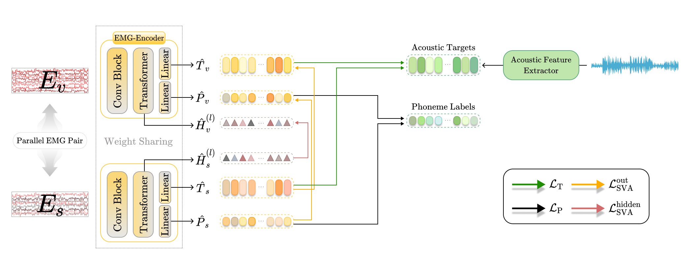

# Enhancing EMG-to-Speech via Silent-Voiced Representation Alignment

 

Silent Speech Interfaces (SSIs) offer an alternative communication pathway by reconstructing intelligible speech from non-acoustic biosignals such as facial electromyography (EMG). In particular, EMG can capture muscle activity associated with articulatory movements even in the absence of vocalization, serving as a suitable modality for silent speech synthesis. A major challenge in EMG-to-speech (ETS) research is the natural absence of ground-truth speech for silent EMG, along with the scarcity of available data. To address this, we propose a novel Silent-Voiced Alignment (SVA) loss, which introduces a multi-level representation-based alignment objective between utterance-parallel silent and voiced EMG pairs. Extensive experiments show that our method significantly enhances content reconstruction and can be seamlessly integrated into existing ETS frameworks. Furthermore, we demonstrate enhanced intelligibility and robustness under a standardized evaluation protocol.
